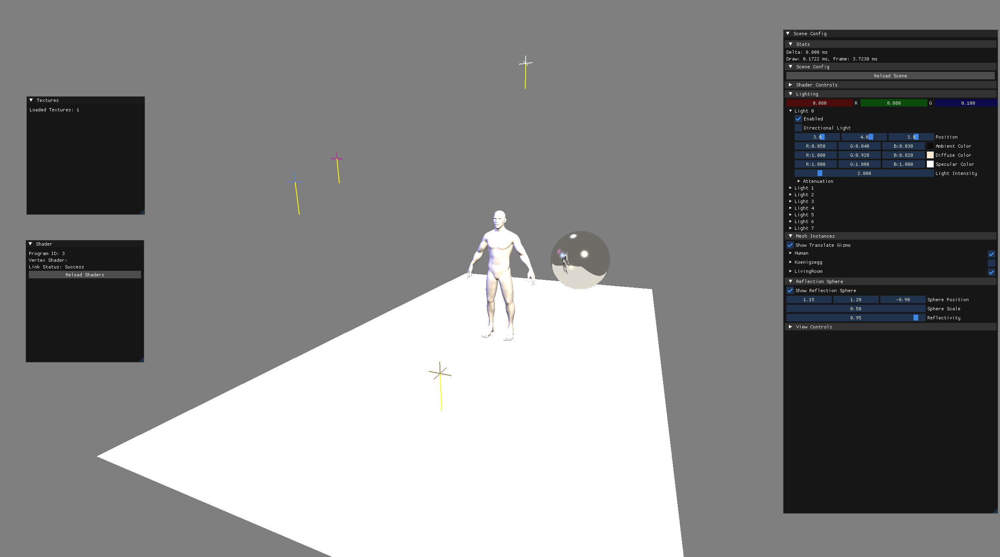
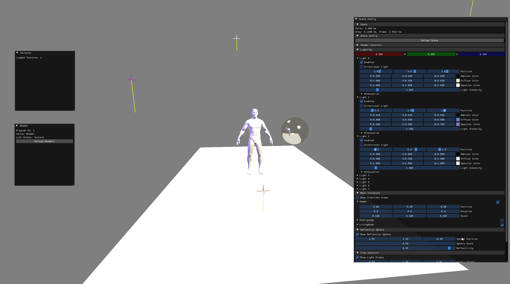
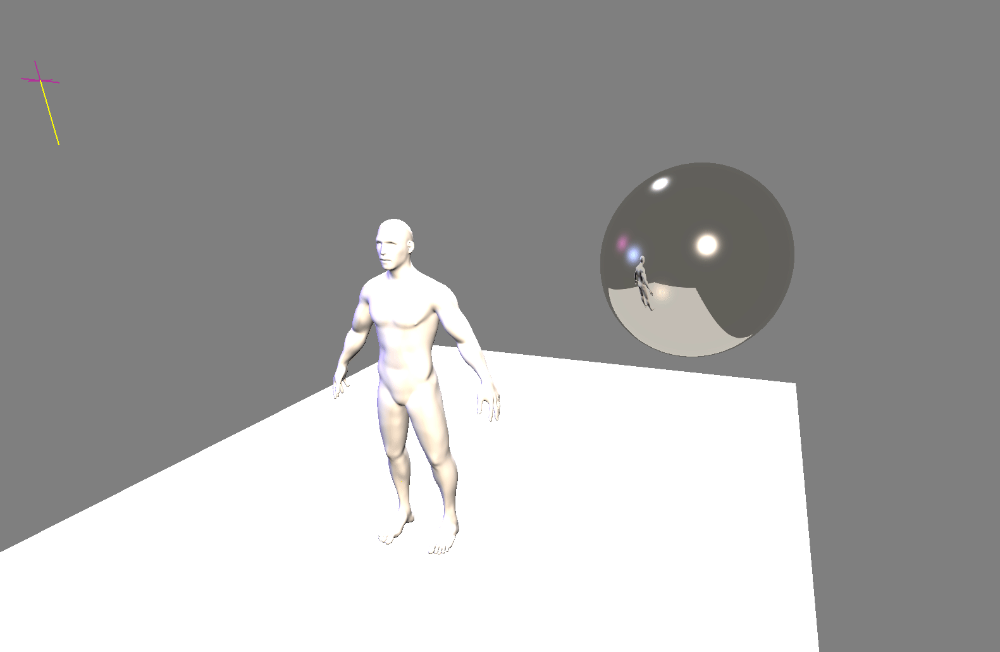
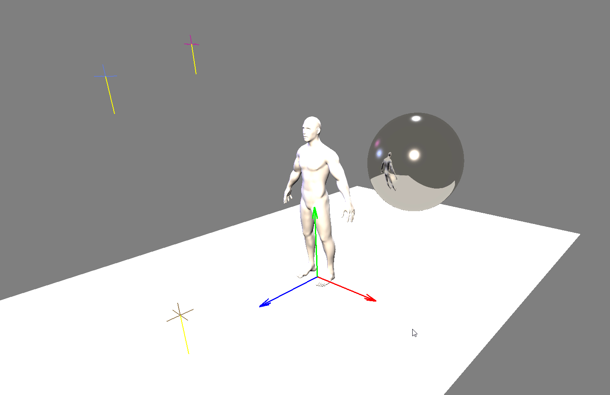
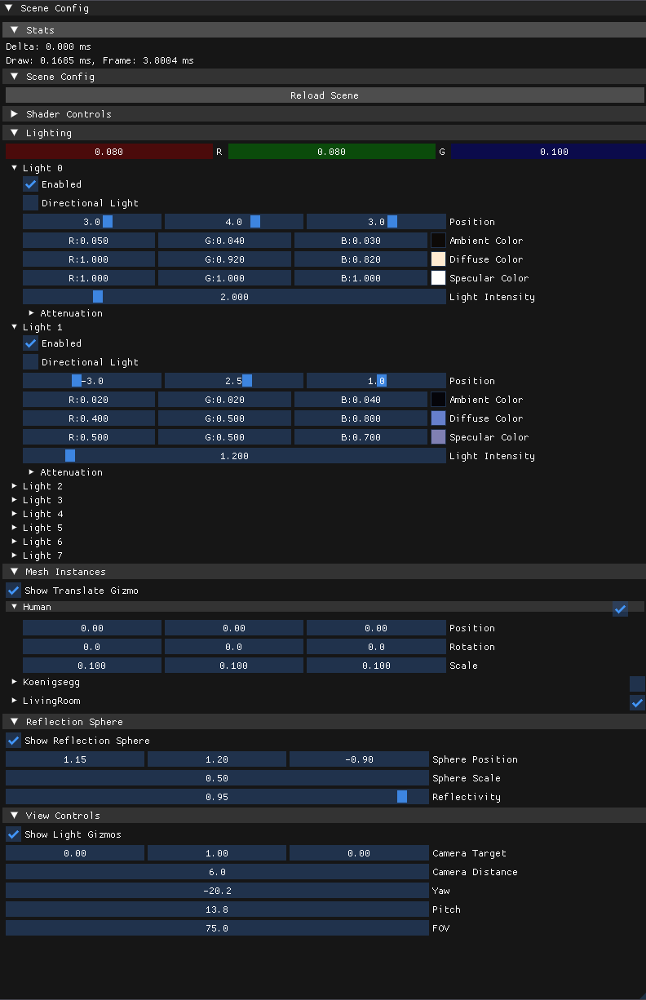

<div align="center">

# ANGD 6372 GL

**A real-time 3D rendering engine built with modern OpenGL, featuring dynamic lighting, cubemap reflections, Lua-driven scene scripting, and a Maya-style viewport.**


[Features](#features) · [Getting Started](#getting-started) · [Controls](#controls) · [Tech Stack](#tech-stack) · [Architecture](#architecture)

</div>

---

## Overview

ANGD 6372 GL is a from-scratch OpenGL rendering engine that loads arbitrary 3D scenes defined entirely through Lua scripts. It supports multi-light Blinn-Phong shading, real-time cubemap environment reflections, and ships with a full ImGui editor for tweaking every parameter live. The viewport uses Maya-style camera controls for intuitive scene navigation.



---

## Features

### Dynamic Multi-Light System

Up to 8 simultaneous lights with full control over position, color, intensity, and attenuation. Supports both point lights and directional lights with real-time toggling. Light gizmos visualize positions and directions directly in the viewport.



### Real-Time Cubemap Reflections

A metallic reflection sphere captures the entire scene into a 256x256 cubemap each frame, then renders it with Fresnel-based chrome shading and tight Blinn-Phong specular highlights. Reflectivity, position, and scale are adjustable in real-time.



### Maya-Style Viewport Controls

Industry-standard camera controls — Alt+LMB orbit, RMB+WASD fly, MMB pan, scroll wheel zoom. Select objects and manipulate them with RGB-colored translate gizmo arrows, just like a DCC tool.



### Lua Scene Scripting

Scenes, meshes, textures, and lighting setups are defined in plain Lua files — no recompilation needed. Swap models, reposition lights, or build entirely new scenes by editing two config files.

```lua
scene = {
    mesh_instances = {
        {
            name = 'Koenigsegg',
            position = { 3.0, 0.0, -1.0 },
            rotation = { -90.0, 0.0, 0.0 },
            scale    = { 0.12, 0.12, 0.12 },
            mesh = 'car'
        },
    },
    lights = {
        {
            enabled = true,
            position = { 3.0, 4.0, 3.0, 1.0 },
            diffuse = { 1.0, 0.92, 0.82, 1.0 },
            intensity = 2.0,
            atten_const = 1.0,
            atten_linear = 0.07,
            atten_quad = 0.01
        },
    }
}
```

### Live ImGui Editor

Full scene inspector panel with collapsible sections for shader controls, per-light editing, mesh instance transforms, reflection sphere tuning, and camera parameters. Every change is reflected immediately.



---

## Tech Stack

| Layer | Technology | Purpose |
|-------|-----------|---------|
| Windowing & Input | **SDL 3.4** | Cross-platform window, events, OpenGL context |
| Rendering | **OpenGL 4.1** + **GLEW** | Modern programmable pipeline, VAO/VBO/FBO |
| Shading | **GLSL 4.10** | Vertex, fragment, and reflection shaders |
| Math | **GLM** | Matrices, vectors, transformations |
| 3D Import | **Assimp** | OBJ/FBX/Blend model loading |
| UI | **Dear ImGui** | Immediate-mode editor interface |
| Scripting | **Lua 5.4** + **Sol2** | Scene and config definition |
| Textures | **STB Image** | PNG/JPG texture loading |
| Build | **MSVC v143** (VS 2022) | C++17, MSBuild |

---

## Architecture

```
┌─────────────────────────────────────────────────────────┐
│                      SDL3 Window                        │
│  ┌──────────────┐  ┌──────────────┐  ┌──────────────┐  │
│  │  Input Layer  │  │  ImGui Layer │  │  GL Context  │  │
│  │  Maya Camera  │  │  Scene Panel │  │  OpenGL 4.1  │  │
│  │  Gizmo Pick   │  │  Light Edit  │  │              │  │
│  └──────┬───────┘  └──────┬───────┘  └──────┬───────┘  │
│         │                 │                  │          │
│  ┌──────┴─────────────────┴──────────────────┴───────┐  │
│  │                  Render Pipeline                   │  │
│  │                                                    │  │
│  │  1. Cubemap Pass  ──▶  Render scene × 6 faces     │  │
│  │  2. Main Pass     ──▶  Scene objects + lighting    │  │
│  │  3. Reflection    ──▶  Chrome sphere + Fresnel     │  │
│  │  4. Overlays      ──▶  Gizmos + grid + ImGui      │  │
│  └────────────────────────────────────────────────────┘  │
│                           │                              │
│  ┌────────────────────────┴───────────────────────────┐  │
│  │                   Data Layer                       │  │
│  │  Lua Scripts ──▶ Scene Graph ──▶ Mesh Instances    │  │
│  │  config.lua       Lights[8]      Transforms        │  │
│  │  scene.lua        Ambient        Visibility        │  │
│  └────────────────────────────────────────────────────┘  │
└─────────────────────────────────────────────────────────┘
```

---

## Getting Started

### Prerequisites

- **Visual Studio 2022** (v143 toolset, C++17)
- **Windows 10/11** (x64)

### Build & Run

1. **Clone the repository**
   ```bash
   git clone https://github.com/JakeeUp/angd-6372-gl.git
   cd angd-6372-gl
   ```

2. **Open the solution**
   ```
   angd-6372-gl.sln
   ```

3. **Set configuration** to `Debug | x64`

4. **Build and run** — all dependencies (SDL3, GLEW, Assimp, Lua) are included in `lib/x64/`. The post-build step copies DLLs automatically.

### Adding Your Own Models

Drop any `.obj` file into `assets/`, then register it in `config.lua`:

```lua
config = {
    meshes = {
        my_model = 'assets/MyModel.obj'
    }
}
```

And instance it in `scene.lua`:

```lua
{
    name = 'My Model',
    position = { 0.0, 0.0, 0.0 },
    rotation = { 0.0, 0.0, 0.0 },
    scale    = { 1.0, 1.0, 1.0 },
    mesh = 'my_model'
}
```

---

## Controls

| Input | Action |
|-------|--------|
| **Alt + LMB Drag** | Orbit camera around target |
| **RMB + WASD** | Fly camera (FPS-style) |
| **RMB Drag** | Orbit (without WASD held) |
| **MMB Drag** | Pan camera |
| **Scroll Wheel** | Zoom in/out |
| **Q / E** (+ RMB) | Move camera down / up |
| **LMB** on gizmo arrow | Drag to translate selected object |
| **Escape** | Quit |

---

## Project Structure

```
angd-6372-gl/
├── angd-6372-gl.sln
├── angd-6372-gl/
│   ├── main.cpp                  # Application entry, rendering, UI, camera
│   ├── Shader.cpp / .h           # Shader compilation & uniform management
│   ├── Mesh.h                    # Mesh data structure
│   ├── SampleRange.h             # Performance sampling utility
│   ├── assets/
│   │   ├── shaders/
│   │   │   ├── basicVert.glsl    # Vertex shader (transforms + normals)
│   │   │   ├── basicFrag.glsl    # Fragment shader (multi-light Blinn-Phong)
│   │   │   └── reflectionFrag.glsl # Cubemap reflection + Fresnel + chrome
│   │   ├── Scripts/
│   │   │   ├── config.lua        # Mesh & texture paths, window settings
│   │   │   └── scene.lua         # Scene graph, lights, instances
│   │   ├── InteriorTest.obj      # Living room environment
│   │   ├── Koenigsegg.obj        # Car model
│   │   └── FinalBaseMesh.obj     # Human figure
│   └── imgui/                    # Dear ImGui (SDL3 + OpenGL3 backends)
├── include/                      # Third-party headers (SDL3, Sol2, STB, etc.)
├── lib/x64/                      # Prebuilt libraries & DLLs
└── glm/                          # GLM math library headers
```

---

## Lighting Setup

The default scene ships with a 5-point studio lighting rig:

| Light | Role | Color | Intensity |
|-------|------|-------|-----------|
| Key | Primary warm light, upper-right | Warm white | 2.0 |
| Fill | Cool blue, left side | Blue | 1.2 |
| Rim | Bright back light, above | White | 1.8 |
| Bounce | Subtle warm from below | Warm yellow | 0.5 |
| Accent | Dramatic side color | Magenta | 0.8 |

Three additional lights are pre-configured but disabled — enable them from the UI for different moods.

---

<div align="center">

Built for ANGD 6372

</div>
